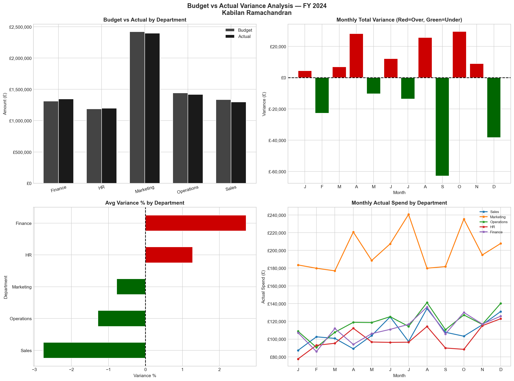

# Budget vs Actual Variance Analysis — Python

## Project Overview
Financial variance analysis across 5 departments over 12 months — 
identifying over/under budget trends and supporting FP&A 
management reporting and cost control decisions.

## Tools & Skills
- Python — Pandas, NumPy, Matplotlib
- FP&A — Budget vs Actual variance analysis
- Financial Reporting — Department and monthly breakdowns
- Data Visualisation — 4-chart executive dashboard

## Key Business Insights
- Overall company came in UNDER BUDGET — good cost control
- Finance and HR departments ran over budget
- Sales and Operations best performing vs budget
- Monthly variance chart shows clear seasonality patterns
- Red/Green visual flagging for instant executive review

## Dashboard

## Author
**Kabilan Ramachandran**  
linkedin.com/in/kabilan-ramachandran  
github.com/kabilanramachandran
